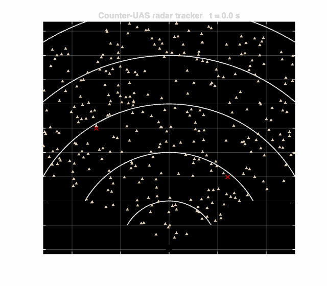
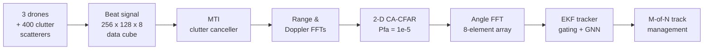
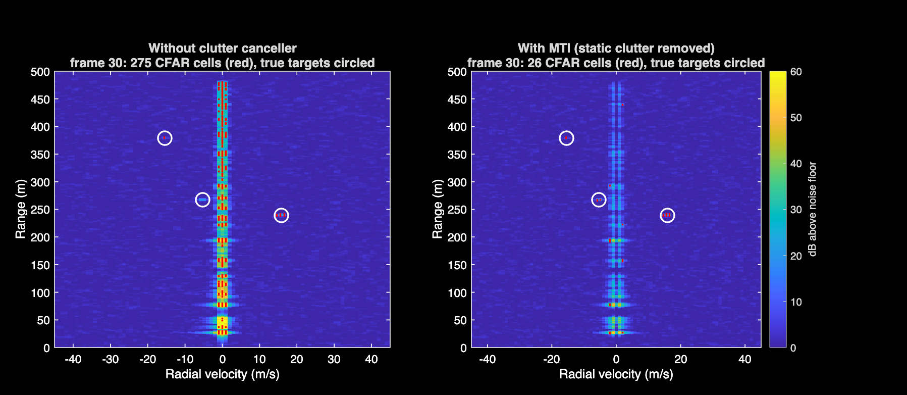
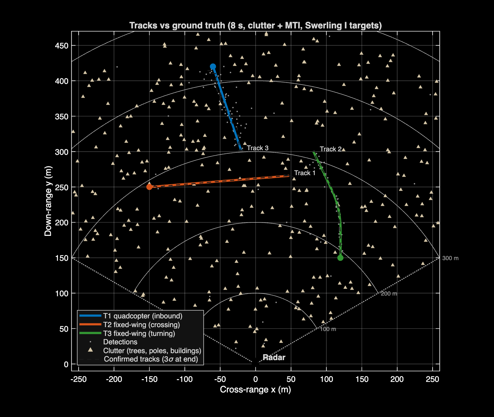
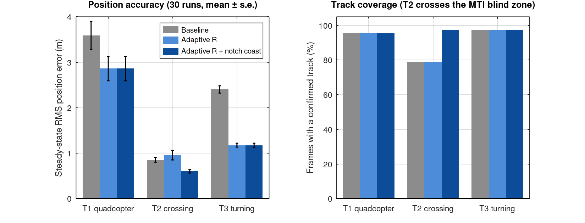
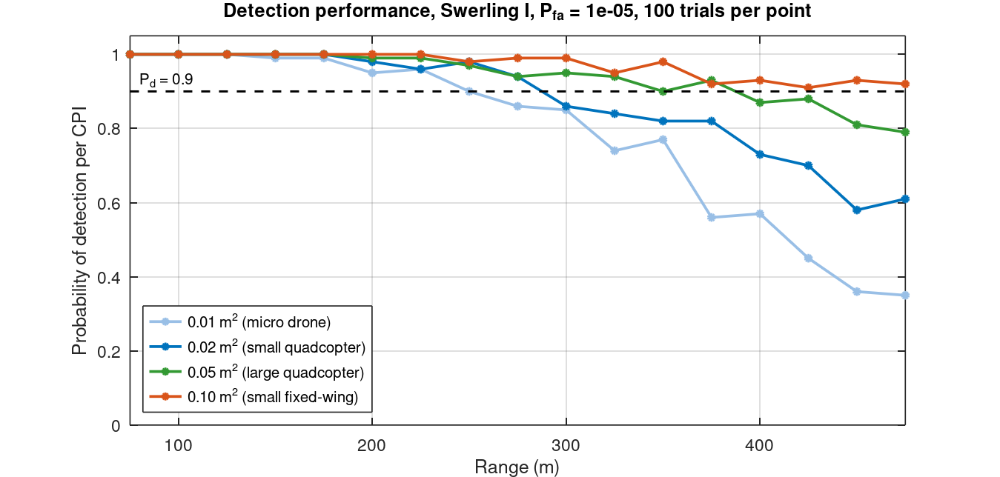
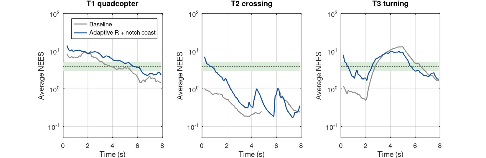
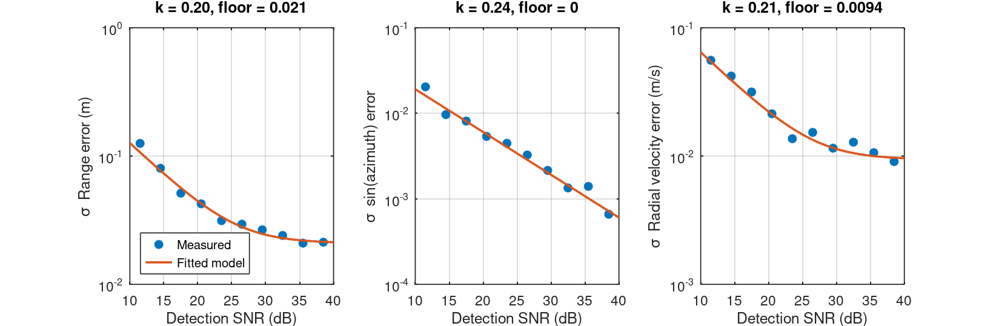

# Counter-UAS Radar: Detection & Multi-Target Tracking of Small Drones
   
   

This is an end-to-end simulation of a short-range **X-band FMCW radar** that finds and tracks small drones in ground clutter. It runs from raw beat signal, through Doppler processing, clutter cancellation, CFAR detection and array angle estimation, to a **multi-target Extended Kalman Filter tracker**. Everything is checked with Monte Carlo statistics and automated tests.

Every algorithm is written from scratch in plain MATLAB with **no toolboxes**.

<p align="center"></p>

## Headline results

From 30 paired Monte Carlo runs, with clutter, MTI and fluctuating (Swerling I) targets:

| | Baseline tracker | Improved tracker |
|---|---|---|
| Turning drone: RMS position error | 2.40 m | **1.18 m** (−51%) |
| Crossing drone: frames with a confirmed track | 79% (breaks every run) | **98%** (no breaks) |
| Crossing drone: RMS velocity error | 2.16 m/s | **0.37 m/s** (−83%) |
| Small quadcopter (0.02 m²): RMS position error | 3.59 m | **2.86 m** (−20%) |
| False confirmed tracks per run | 0 | 0 |

- **Clutter:** the MTI clutter canceller cuts false detections from about 55 per frame to 0.3.
- **Detection range (Pd ≥ 0.9):** a 0.02 m² quadcopter is detected out to about **290 m**, and a 0.05 m² one out to about **390 m** (0.5 W transmitter).
- **Tests:** 7 automated tests check the maths (CFAR false-alarm rate, EKF Jacobian, filter consistency and more).

## Why I built this

I'm a second-year engineering student at the University of Sydney. I work with UAVs on a student design-build-fly team and I'm training for my pilot's licence. That made me curious about the other side of the problem: **how do you find a small drone that is slow, low and barely reflects radar**, when trees and buildings reflect a million times more energy? Counter-UAS is now a core problem in defence and airport security, and it combines everything I'm studying: signals and systems, electromagnetics, estimation and software.

## How it works



| Stage | What it does | Key design choice |
|---|---|---|
| **Waveform** | 10 GHz FMCW, 150 MHz sweep, 128 chirps, 15 ms dwell | 1.95 m range and 0.98 m/s velocity resolution, ±62 m/s unambiguous |
| **Signal model** | Radar equation, Swerling I targets, 400 discrete clutter scatterers with wind motion | Realistic dynamic range: clutter is up to 70 dB above the noise |
| **MTI** | Removes the slow-time mean (anything stationary) | Creates a ±1.5 m/s blind zone that the tracker must handle |
| **CFAR** | 2-D cell-averaging, circular in Doppler | Threshold derived for 8-channel non-coherent integration (see below) |
| **Angle** | 256-point FFT across the array, sub-bin interpolation | ~0.1–1° accuracy depending on SNR |
| **Tracker** | CV-model EKF, polar measurements, χ² gating, GNN assignment | SNR-adaptive noise, blind-zone-aware coasting |

Full reasoning, equations and link budget: **[docs/DESIGN.md](docs/DESIGN.md)**

## Results

### 1. Clutter cancellation
Stationary clutter forms a bright ridge at zero Doppler that floods the detector. The MTI canceller removes it and leaves the three drones.



### 2. Tracking in clutter
The plot shows the confirmed tracks (dashed) against ground truth, with each track's 3σ uncertainty ellipse. There is one track per drone for the whole 8 s, including through the turn and the MTI blind zone.



### 3. Baseline vs improved tracker (30-run Monte Carlo)
All three tracker designs run on *identical* detections in every run, so the differences come from the tracker alone.



| Target | Tracker | Position RMS (m) | Velocity RMS (m/s) | Coverage | Breaks per run |
|---|---|---|---|---|---|
| T1 quadcopter | Baseline | 3.59 ± 1.69 | 2.93 ± 1.98 | 95% | 0.10 |
| | Adaptive R | 2.86 ± 1.47 | 2.30 ± 1.37 | 95% | 0.00 |
| | **Full** | **2.86 ± 1.47** | **2.30 ± 1.37** | **95%** | **0.00** |
| T2 crossing | Baseline | 0.85 ± 0.28 | 2.16 ± 1.05 | 79% | 1.00 |
| | Adaptive R | 0.96 ± 0.57 | 2.33 ± 1.31 | 79% | 1.00 |
| | **Full** | **0.60 ± 0.20** | **0.37 ± 0.12** | **98%** | **0.00** |
| T3 turning | Baseline | 2.40 ± 0.44 | 2.49 ± 0.15 | 98% | 0.00 |
| | Adaptive R | 1.18 ± 0.24 | 1.62 ± 0.13 | 97% | 0.07 |
| | **Full** | **1.18 ± 0.24** | **1.62 ± 0.13** | **97%** | **0.07** |

*The ± values are standard deviations across the 30 runs, using the steady-state error (first second of each track excluded).*

### 4. Detection performance envelope



| Target | RCS | Range at Pd ≥ 0.9 |
|---|---|---|
| Micro drone | 0.01 m² | ~250 m |
| Small quadcopter | 0.02 m² | ~290 m |
| Large quadcopter | 0.05 m² | ~390 m |
| Small fixed-wing | 0.10 m² | ≥ 475 m (edge of coverage) |

### 5. Filter consistency (the honest part)
NEES measures whether the filter's claimed uncertainty matches its real error. It should sit inside the green 95% band.



It doesn't always. The crossing drone sits *below* the band: the filter is under-confident, because the process noise is tuned for manoeuvres this target never makes. The turning drone rises *above* the band during the turn: a constant-velocity model can't follow a 3 m/s² turn. **A single motion model can't be consistent for straight-flying and manoeuvring targets at the same time.** That is exactly the problem an Interacting Multiple Model (IMM) filter solves, and it's the next step.

## Engineering decisions and what went wrong

1. **A CFAR bug that cost 5.5 dB.** The textbook CA-CFAR threshold assumes single-channel (exponential) noise. Summing 8 array channels makes the noise Gamma(8)-distributed, so the real false-alarm rate was about **10⁻³⁰ instead of 10⁻⁵** and the smallest drone disappeared. I derived the correct threshold and solved it numerically and added a test that measures Pfa.

2. **Redesigning the waveform around the blind zone.** With 64 chirps, velocity resolution was 3.9 m/s, so the MTI blind zone was ±6 m/s wide and the crossing drone vanished for 5 s. I traded unneeded max velocity (±125 m/s) for a longer dwell: **4× finer resolution**, 3 dB more gain, and a blind zone of ±1.5 m/s.

3. **Measuring accuracy instead of guessing it.** `run_calibration.m` fits measurement error against SNR, which follows the resolution/√SNR law from estimation theory. The tracker uses that fit to weight each detection individually.

4. **Knowing when not to trust a perfect measurement.** An almost noise-free Doppler measurement made the EKF over-confident (NEES ≈ 30), through the nonlinear coupling between range-rate and position. Real drones also have micro-Doppler spread, so I set a deliberate 0.15 m/s floor.



## Quick start

```matlab
>> setup_paths
>> run_demo            % one scenario, all figures           (~30 s)
>> run_monte_carlo     % 30-run statistical comparison        (~5 min)
>> run_pd_curve        % detection range vs target size        (~3 min)
>> run_calibration     % measurement accuracy vs SNR           (~1 min)
>> run_tests           % 7 automated tests                     (~5 s)
```

Figures are written to `docs/img/`. Every run is seeded, so the results are reproducible. The code also runs in GNU Octave.

## Repository layout

```
├── run_demo.m               single scenario, end to end
├── run_monte_carlo.m        paired Monte Carlo comparison of tracker designs
├── run_pd_curve.m           Pd vs range for four target sizes
├── run_calibration.m        measurement error vs SNR -> tracker noise model
├── src/
│   ├── radar/               parameters, scenario, clutter, data-cube synthesis
│   ├── processing/          MTI, range-Doppler, CFAR, angle estimation
│   ├── tracking/            EKF, measurement model, gating, track management
│   ├── sim/                 scenario runner, seeding
│   ├── eval/                track scoring, NEES
│   └── viz/                 figures and GIF
├── tests/                   automated test suite (run_tests)
├── docs/
│   └── DESIGN.md            design rationale, link budget, equations
└── .github/workflows/ci.yml runs the tests on every push
```

## Limitations and next steps

This is a simulation with simplifying assumptions: drones are single points, it works in 2-D only and the hardware is ideal. The next thing I want to add is an IMM filter, to fix the consistency problem in section 5.

## References

- M. A. Richards, *Fundamentals of Radar Signal Processing*, 2nd ed., McGraw-Hill, 2014.
- Y. Bar-Shalom, X. R. Li, T. Kirubarajan, *Estimation with Applications to Tracking and Navigation*, Wiley, 2001.
- M. I. Skolnik, *Introduction to Radar Systems*, 3rd ed., McGraw-Hill, 2001.
- S. Rao, *Introduction to mmWave Sensing: FMCW Radars*, Texas Instruments, 2017.

---
*Author: Agastya, Engineering, The University of Sydney. MIT licence.*

*Developed with AI assistance from Claude.*
